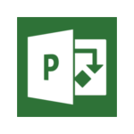
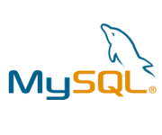

# Week 2 – Team, Roles and Technology

Last week we introduced our project idea, but not the team itself. Today we will let you know who we are and how we want to achieve our goal.

## Our Team
Our WGPlaner team consists of three people and each member has the goal to create the best organizer for shared flats, to create something new and helpful, which will make living with others easier. We have specified the roles in our team based on the [IBM Rational Unified Process](https://www.ibm.com/developerworks/rational/library/apr05/crain/).

## Roles

**Project Manager**  
The project manager will take care of coordinating the project, defining priorities and ensuring that the team is focused so that quality standards don’t decrease over time. Managing time, risks and resources is the key to a successful project.

**Test Designer**  
Each member has the responsibility to not only add tests for their own code but for others as well. Designing good tests is hard. This is why everyone will look at and improve other tests so that possible bugs are found as soon as possible to avoid them after deployment.

**Implementer**  
We all take part in the actual development of WGPlaner as everyone will contribute code to the project. Whether it’s the android application or the backend server, everyone takes the role of the implementer by coding specific components.

**Requirements specifier**  
Specifying requirements is important so that the structure of the project can be set at the beginning. Having to restructure a project because some requirements were not known from the start is a no-go and is a hassle in software development.
It is significant that the team members communicate with colleagues to get a good understanding of how each feature will work.

**Tool Specialist**  
Developing modern software has become more and more difficult. That’s why tools take a big part in the process of software development. Having continuous integration and code coverage services help a lot. Our tool specialist will select the best tools for our development process.

**Change Control Manager**  
Pushing new code to the project is fundamental and so is reviewing. The change control manager will control the flow of changes. He will merge new code into the existing codebase as well as comment on new pull requests so that the codebase is clean and simple. He might select other reviewers as well so that code is reviewed by the most fit developer.

**Business Designer**  
Specifying responsibilities, operations and relationships of business workers will be done by one developer. But while only one has the role of business designer, the whole team will help him by providing feedback to make this project a success.

## Technologies

### Language
We will use Java for android development as it is the most widely used language for this platform and is supported by Google. XML will also be used for views by the android [SDK](https://developer.android.com/studio/index.html).

For the backend service we will use [Go](https://golang.org/). Go has a static type system, is a compiled language and makes deployment very easy. It comes with many libraries and tools which make web development straightforward.

### Framework
The [Android SDK](https://developer.android.com/studio/index.html) is the framework of choice for developing android applications. It is well tested and well supported and the build system [Gradle](https://gradle.org/) is deeply integrated into the IDE. On top of that we will use [Mockito](http://site.mockito.org/), [JUnit](http://junit.org/junit4/) and [Espresso](https://developer.android.com/training/testing/espresso/index.html) for testing.

[Macaron](https://go-macaron.com/) is used as a web framework for [Go](https://golang.org/). It is used by large projects like [Gitea](https://gitea.io/en-US/) and [Gogs](https://gogs.io/) and is therefore well tested and suitable for our project.

### Hosting
We will host our blog, backend service, management board and continuous integration service on a root server at [Netcup](https://www.netcup.de/vserver/). Our code base will be uploaded on [GitHub](https://github.com/WGPlaner/wg_planer).

### Building and Deployment
Continuous integration is important in modern software development. We decided to use [TeamCity](https://teamcity.ameyering.de/) for this and will host it on our server at [Netcup](https://www.netcup.de/vserver/). [Git](https://de.wikipedia.org/wiki/Git) is used as our version control system in combination with [GitHub](https://github.com/WGPlaner/wg_planer). [GitHub](https://github.com/WGPlaner/wg_planer) and [TeamCity](https://teamcity.ameyering.de/) can be connected so that each Git commit and [GitHub](https://github.com/WGPlaner/wg_planer) pull-request is tested before it is merged into the codebase.

### Project Management
[YouTrack](https://youtrack.ameyering.de/) is used for planning and scrumming, bug tracking and other project related issues. Microsoft Project is also used for Gantt diagrams, etc.

### IDE
We use Android Studio for android development and [GoLand](https://www.jetbrains.com/go/) for backend development in Go. Both integrate well with [TeamCity](https://www.jetbrains.com/teamcity/) and [YouTrack](https://www.jetbrains.com/youtrack) as all of those tools are developed by JetBrains.
