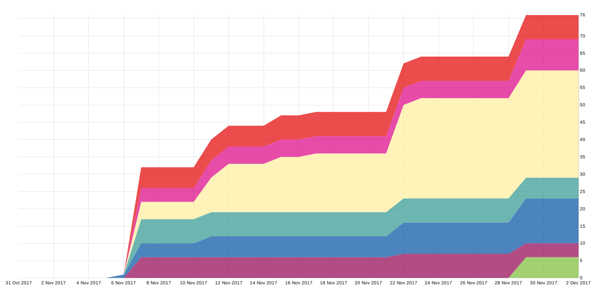

# Week 9 – Gantt Chart

This week we created our Gantt chart. 

We use YouTrack which has an integrated Gantt chart report. Our Gantt chart is available here: https://youtrack.ameyering.de/reports/gantt/127-1

One helpful aspect of the Gantt chart is that it displays whether the time for a task was over- or underestimated. Moreover, the dependencies are visualized. But as you can see, with YouTrack it's rather confusing than helpful. We didn't find a way to customize the chart so that the issues are sorted by creation time, etc.
We also weren't able to export the issues in such a way that we could import them into Microsoft Project to create an Gantt chart.

Because of this, we additionally created a report which visualizes the [cumulative flow](https://youtrack.ameyering.de/reports/cumulativeFlow/140-0) of our issues (grouped by workflow).
(Note that we didn't assign workflows to our issues until "Elab #2")

The cumulative flow shows us in which phase our project is and which workflow currently is our main focus.

