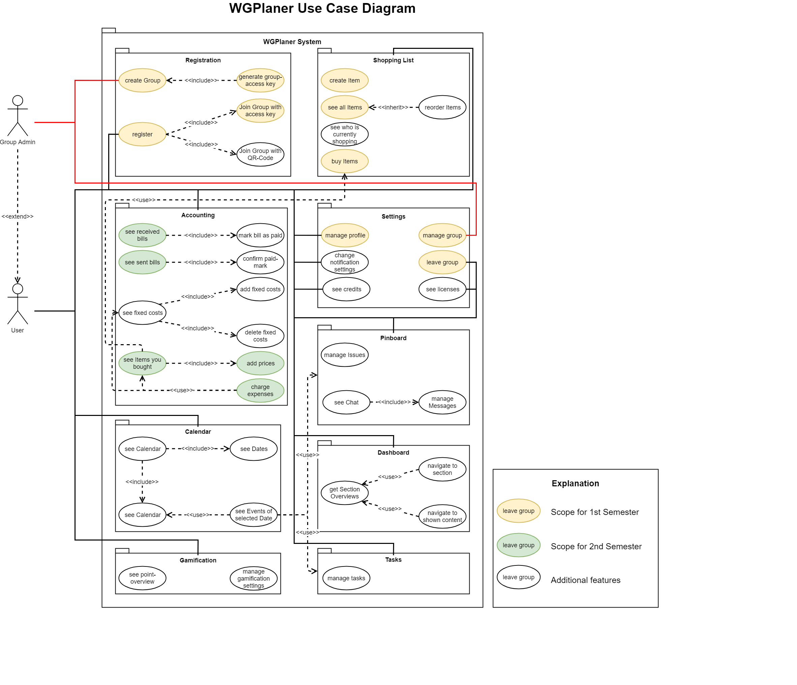

# We're back | Risk Management

## New semester
This semester we have some changes regarding our team, use-cases and more. So keep reading :-)

## Fewer team members
Sadly, Nina leaves our team. She has been a great team member for the last
months and we will miss her dearly. But we will keep on going and
will finish this project!

We now only have two members left, Arne and Andre.

## New Scope
Because of this, we reduced our planned scope for this semester. The updated use case diagram can be seen below and can also be found on our [GitHub repository](../SRS/use_case_diagram.png). Therefore our scope for this semester is the accounting page including receiving/creating bills, adding/editing costs and more.

## Change in technology?
Java for our Android application and Go for the backend proved to be a good choice and we will continue using them. TeamCity as our continuous integration service for the android app still works as well but we plan on adding TravisCI as another continuous integration service to integrate it with https://bintray.com/ for "Continuous deployment". "Continuous deployment" is a keyword we will look into in the next weeks, so keep updated :-)

## Time spent so far
WGPlaner is a time intensive project. Mostly because of new technologies we have to learn and project management tasks. You can find a time report on our [YouTrack instance](https://youtrack.ameyering.de/reports/time/120-7).

## Risk Management
No project is perfect. Many fail. That's why we have to keep risk management in mind. For that we created a risk plan. To keep things up-to-date, we’re not going to post an image of our current risk plan on this blog but instead just link to the plan in our GitHub repository which you can find [here](../RiskManagement/risk_management.md).

Feel free to ask any questions regarding anything! 😀
