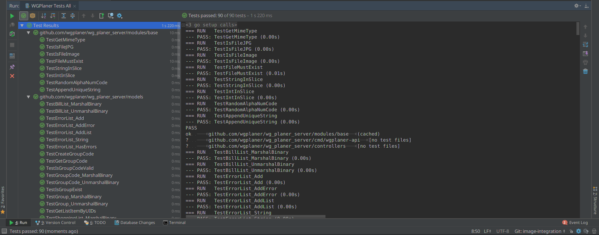
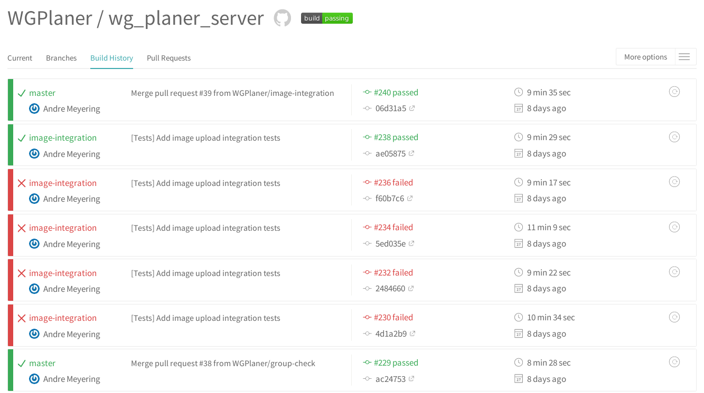
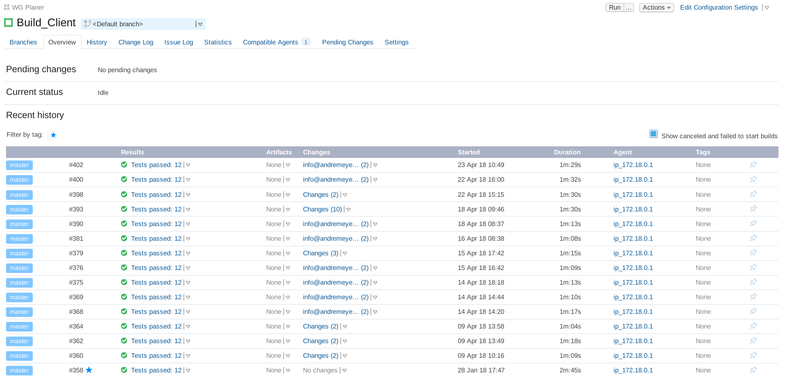
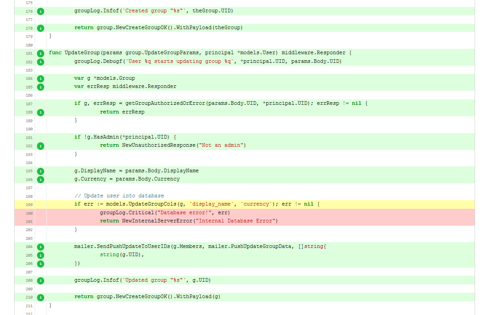
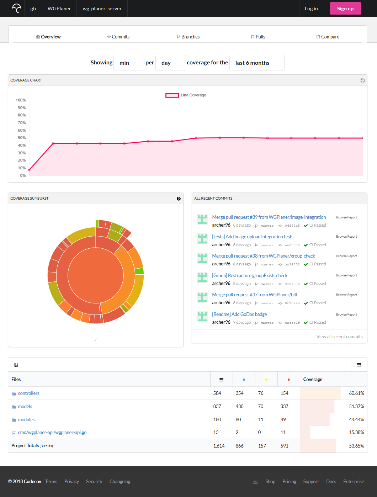
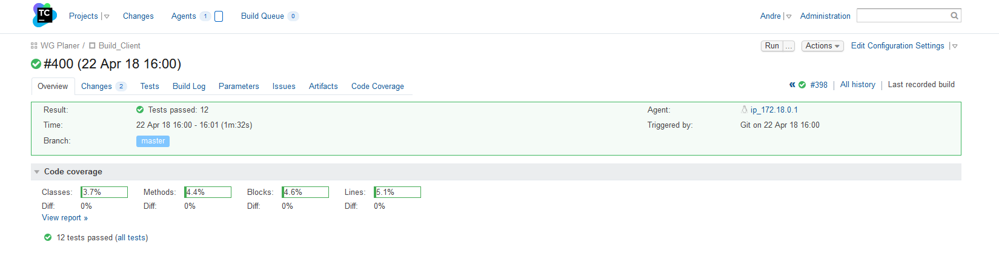
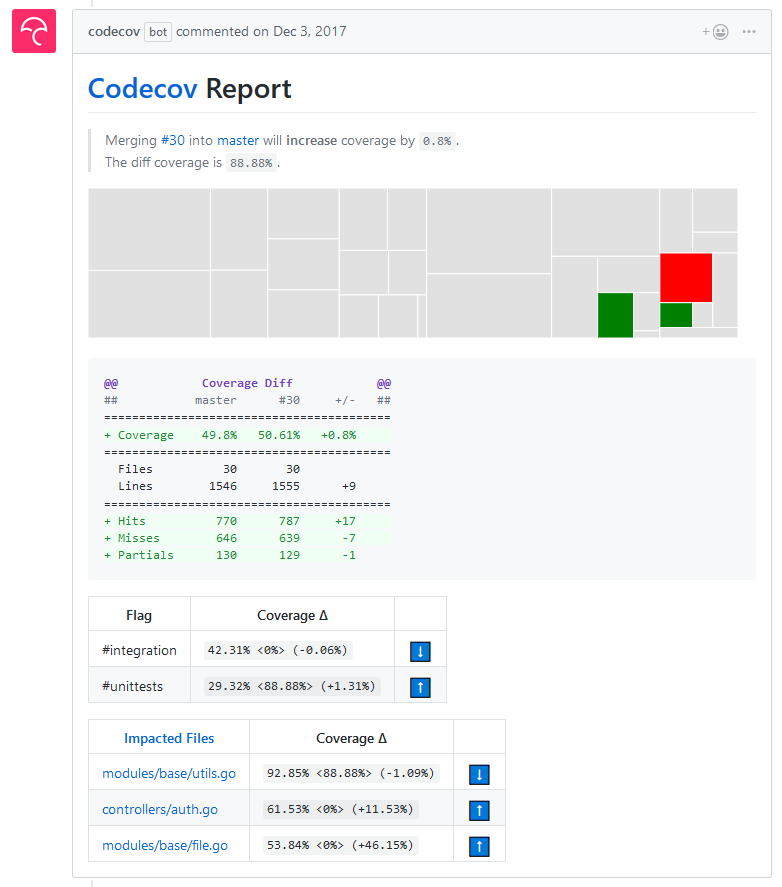
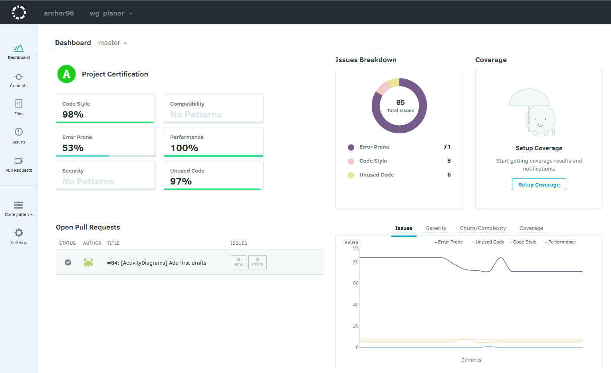

# Testing | Test Plan

This week is all about testing. For this, we created a new document called "Test Plan", which can be found [here](../TestPlan/TestPlan.md).

## Why testing?
Testing is an important part of modern software development. It helps to find bugs before a product is even released.
Furthermore it takes the risk of breaking a working application e.g. through refactoring. This is especially good news 
for new developers that are not yet familiar with the whole code base.

Always remember to write negatives as well as positive tests. Most errors occur in error handling:
> **Positive testing** determines that your application works as expected.
> If an error is encountered during positive testing, the test fails.
> **Negative testing** ensures that your application can gracefully handle invalid input or unexpected user behavior.
> For example, if a user tries to type a letter in a numeric field, the correct behavior in this case would be to
> display the “Incorrect data type, please enter a number” message. The purpose of negative testing is to detect
> such situations and prevent applications from crashing. Also, negative testing helps you improve the quality of
> your application and find its weak points.
>  - https://smartbear.com/learn/automated-testing/negative-testing/

## How to test?
How a test should be written depends on some criteria. i.e. programming language, framework and the type of the test.
If you have never written tests before, read this post and then check out further articles for your programming language.
For our application we use three testing strategies:
 1. Unit Testing
 2. User Interface Testing
 3. Integration Testing

### Unit Testing
By testing each unit we guarentee that functions work as expected.
Take for example a function that returns the square root of a given number. How can we assure that this function works as expected?
The simplest approach is to call the function with edge cases and check the result with the expected value. In our example this
would mean checking the function against values like `0`, `100` and `-1`.

For our application we use [`JUnit`](https://junit.org/) for the client and [`go test`](https://golang.org/pkg/testing/) 
for the backend. Here are some examples of our unit tests:

 - Server: [Utils Unit Test](https://github.com/WGPlaner/wg_planer_server/blob/master/modules/base/utils_test.go)
 - Client: [Example Unit Test](https://github.com/WGPlaner/wg_planer/blob/master/app/src/test/java/de/ameyering/wgplaner/wgplaner/ExampleUnitTest.java)

### User Interface Testing
The user interface is seen by the end-user and must therefore work as expected. Testing the UI means testing if buttons work, 
if text can be entered into text fields and so on.

Please refer to  our [blog post of week 6](https://wgplanerblog.wordpress.com/2017/11/12/week-6-gherkin-feature-files/)
to learn more about our UI testing approach.

### Integration Testing
To test our API calls in the backend we use integration testing. Each API call is tested against different edge cases (e.g.
not authenticated, etc.). For that we have created so called "fixtures" that represent user data 
(for an example, see [here](https://github.com/WGPlaner/wg_planer_server/blob/master/models/fixtures/user.yml)).
For each test a new and clean database is created so that integration tests do not influence other ones.
Have a look at one of our integration tests [here](https://github.com/WGPlaner/wg_planer_server/blob/master/integrations/group_test.go).

## How to run tests?
Most IDEs support testing. The IDEs we use (AndroidStudio and GoLand) support testing and even have a nice UI.
Following screenshot shows how successfully run tests look like in GoLand:

## Automation | Continuous Integration
Every developer should run all tests before pushing changes to a repository. 
If they don't, breaking changes might keep being unnoticed for a while. But even if they do test their code, merging multiple
branches could lead to new bugs. So wouldn't it be useful if testing could be automated? This is where "continuous integration" 
comes into play. Services like [TravisCI](http://travis-ci.org/) run your test code for each commit and pull request. With this,
breaking changes will be discovered right away.

But not only breaking changes can be discovered by this. If you follow a given code style, tools like 
[Artistic Style](http://astyle.sourceforge.net/) and `go fmt` can check for them and can even reformat your code to follow 
the style convention. If you want to know more about Artistic style, you can have a look at our 
[artistic style configuration](https://github.com/WGPlaner/wg_planer/blob/master/.astylerc).

We use quite a few CI services for our client and server application. Following table lists them:

|            | Continuous Integration Service                              | Badge |
|------------|-------------------------------------------------------------|:-----:|
| **Client** | [TeamCity](https://teamcity.ameyering.de/viewType.html?buildTypeId=WgPlaner_BuildClient&guest=1) | [/statusIcon)](https://teamcity.ameyering.de/viewType.html?buildTypeId=WgPlaner_BuildClient&guest=1) |
|            | [TravisCI](https://travis-ci.org/WGPlaner/wg_planer)        |  |
| **Server** | [TravisCI](https://travis-ci.org/WGPlaner/wg_planer_server) |  |
|            | [AppVeyor](https://www.appveyor.com/docs/) (*on hold because a framework does not support windows) |  |

Have a look at the configuration files for our used CI services:

 - [Server `.travis.yml`](https://github.com/WGPlaner/wg_planer_server/blob/master/.travis.yml)
 - [Server `.appveyor.yml`](https://github.com/WGPlaner/wg_planer_server/blob/master/.appveyor.yml)
 - [Client `.travis.yml`](https://github.com/WGPlaner/wg_planer/blob/master/.travis.yml)

Following screenshots show the build history of our server on TravisCI and of our client on TeamCity:

## Is everything tested? | Code Coverage
How can we assure that every possible code execution branch is being tested? The answer is: *Code Coverage*.
Code coverage tells us what code is covered by tests. Tools like [codecov.io](https://codecov.io/) help us to get an overview.
The screenshot below shows you how code coverage is visualized by codecov:

It is obvious that this helps to find bottlenecks of your tests. The codecov dashboard for our server looks like this:

We can see how much of our application is covered by tests in percent and more.
TeamCity gives us an overview for our android application as well:

### How to calculate code coverage
The tools mentioned above only visualize the code coverage data that we uploaded. But how does one calculate code coverage?

As our server uses `go` as a programming language, we use `go test` for testing.
`go test` is also able to calculate code coverage and with it we can even
distinguish between unit and integration tests. We have written a bash script
[`coverage.sh`](https://github.com/WGPlaner/wg_planer_server/blob/master/scripts/coverage.sh) for our application.
Take a look at it if you want to use `go test` in your project.

Our client uses Android with `JUnit` for unit tests. To get the code coverage for the application, we use
[jacoco](https://en.wikipedia.org/wiki/Java_Code_Coverage_Tools) (Java Code Coverage Tools). 
You can check out our [`jacoco` gradle](https://github.com/WGPlaner/wg_planer/blob/master/app/jacoco.gradle) 
file to learn about `jacoco`.

## Is there more? | Code Reports
Code coverage is awesome. But how can we avoid regressions in code coverage?  For this we use the codecov report card.
The report is created by codecov for each pull request after the coverage data is uploaded. The report clearly shows us
where code coverage has in- or decreased. It is a really useful tool which we can only recommend.
The screenshot below shows such a report:

But wait, there's more! We also use [codacy](https://app.codacy.com/). Codacy is a tool that checks for common errors.
It works by running multiple tools against your codebase (e.g. `cppcheck` for C++ projects, linters, etc.). There might
be false positives and not-so-useful errors, but most of the time the reports created by codacy for pull requests are correct.
The codacy dashboard gives us a good overview:

Codacy has one downside: It does not have many checks for go-based projects.
That's why we also use [goreportcard](https://goreportcard.com/report/github.com/wgplaner/wg_planer_server).
We won't go into detail because it is only for go-based projects. But feel free to ask more about it if you want. :-)

## More?
That's all for this week. We hope that this post gives you a good overview on what testing is, 
how you can test and what testing tools are available.
Don't forget to check out our [Test Plan](../TestPlan/TestPlan.md) ;-)

