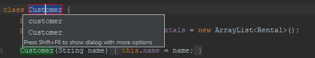

# Refactoring

This week was all about refactoring. We highly recommend Martin Fowler’s book "Refactoring: Improving the Design of Existing Code" as we used the examples and techniques in his book.

Below are links to our GitHub repositories containing the source code and tests of Arne and Andre.

- Arne: [GitHub](https://github.com/ArneSchulze/SE_2018_Refactoring)
- Andre: [GitHub](https://github.com/bugwelle/SE_2018_Refactoring)

Both of us used [JetBrain's Intellij](https://www.jetbrains.com/idea/) to refactor the project. It has some useful tools for refactoring existing code such as renaming variables/functions/classes, static code analysis and more, errors are shown while you're typing, etc.
All of this makes the IDE very useful.

Our most used feature is renaming (`Shift + F6`). It is not simply searching and replacing strings but instead actually renames variables or functions. This makes it especially usful for refactoring. Below is a screenshot of this:

