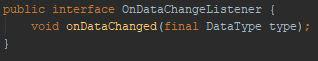
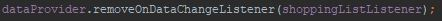

# Software Patterns

Hey guys,

this week is all about software patterns. 

## Android
As a pattern for our android application we have chosen the *Observer Design Pattern*. We can't provide before &amp; after images as we started using this pattern right from the beginning (for refactoring, see section "Golang Server"). It is explained in detail on [www.philipphauer.de](https://www.philipphauer.de/study/se/design-pattern.php) [German]. Here is a quick overview.

### Observer Pattern
In this pattern an object (subject) maintains a list of its dependents (observers) and notifies them automatically of any state changes. You may be familiar with this pattern even if you're not aware of it. For example JavaScript uses it extensively with its `element.addEventListener('click', callback)`. If a user now clicks on `element`, all listeners (observers) are notified.

In our case we use it for notifying the UI about data changes, as callbacks for network operations and of course for button clicks, etc.

Here is an example of an listener interface that we use throughout our code base.



Our data class `DataProvider` has methods that allow us to add functions (to be specific: classes that implement `DataProvider.OnDataChangeListener`) that are called when the underlying data is changed. We can add and remove those listeners as shown in the two images below:




A listener "function" could look like this:


You can find our `DataProvider` on [GitHub](https://github.com/WGPlaner/wg_planer/blob/master/app/src/main/java/de/ameyering/wgplaner/wgplaner/utils/DataProvider.java).

## Golang Server
Go is not an object oriented programming language and therefore some patterns can't be applied in the common way. But we were lucky to find a GitHub repository that gives a great overview about Go design patterns. You can find it here: https://github.com/yksz/go-design-patterns
We choose to implement the "Builder pattern". The example file in above mentioned project makes this pattern obvious. Have a look at it [here](https://github.com/yksz/go-design-patterns/blob/master/creation/builder.go). 

The way we use it, is to have a valid object after using the builder. Why is this important? The answer is rather simple. Imagine having a user with "Name" and "Birthdate". If we use a simple class/struct, we have to take care that all mandatory fields are set wherever we create a new user object. But by using a builder, we can assure that all fields are set when the object is created. This is especially useful if we plan on adding new mandatory fields. Of course, a method like `isValid()` would have the same effect but we'd need to take care to use it every time.

In this post, we refactor our `user` "class".  
*Note:* Go doesn't have classes as you know them from Java/C++/...  
*Note:* Even though there are multiple builders in the example, we use just one for a user.  

You can check out the commit that introduces the builder pattern [here](https://github.com/WGPlaner/wg_planer_server/commit/308833bc14828ea5cd1afecdd9b75b62005ba885). Let's have a look at how we use it:

```
// Create new user
userBuilder := models.UserBuilder{}
userBuilder.SetDisplayName(params.Body.DisplayName)
userBuilder.SetUID(params.Body.UID)
userBuilder.SetEmail(params.Body.Email)
userBuilder.SetFirebaseInstanceID(params.Body.FirebaseInstanceID)
u, err := userBuilder.Construct()
```

Pretty straightforward and easy, isn't it? We think that the builder pattern is a good way of handling data validation and we will continue using and implementing it.


See you next week! :-)
