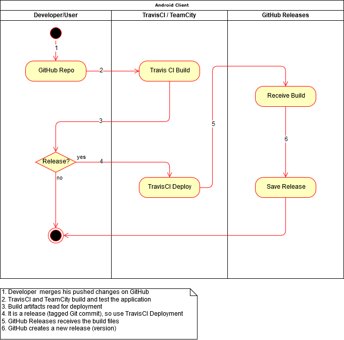

# Software Architecture Document

# Table of Contents
- [Introduction](#1-introduction)
    - [Purpose](#11-purpose)
    - [Scope](#12-scope)
    - [Definitions, Acronyms and Abbreviations](#13-definitions-acronyms-and-abbreviations)
    - [References](#14-references)
    - [Overview](#15-overview)
- [Architectural Representation](#2-architectural-representation)
- [Architectural Goals and Constraints](#3-architectural-goals-and-constraints)
- [Use-Case View](#4-use-case-view)
    - [Use-Case Realizations](#41-use-case-realizations)
- [Logical View](#5-logical-view)
    - [Overview](#51-overview)
    - [Architecturally Significant Design Packages](#52-architecturally-significant-design-packages)
- [Process View](#6-process-view)
- [Deployment View](#7-deployment-view)
- [Implementation View](#8-implementation-view)
    - [Overview](#81-overview)
    - [Layers](#82-layers)
- [Data View](#9-data-view)
- [Size and Performance](#10-size-and-performance)
- [Quality](#11-quality)

## 1. Introduction

### 1.1 Purpose
This document provides a comprehensive architectural overview of the system, using a number of different architectural views to depict different aspects of the system. It is intended to capture and convey the significant architectural decisions which have been made on the system.

### 1.2 Scope
This document describes the architecture of the WGPlaner project.

### 1.3 Definitions, Acronyms and Abbreviations

| Abbrevation | Description                            |
| ----------- | -------------------------------------- |
| API         | Application programming interface      |
| MVC         | Model View Controller                  |
| REST        | Representational state transfer        |
| SDK         | Software development kit               |
| SRS         | Software Requirements Specification    |
| UC          | Use Case                               |
| VCS         | Version Control System                 |
| n/a         | not applicable                         |

### 1.4 References

| Title                                                              | Date       | Publishing organization   |
| -------------------------------------------------------------------|:----------:| ------------------------- |
| [WGPlaner Blog](http://wgplanerblog.wordpress.com/)                | 2017-11-26 | WGPlaner Team             |
| [GitHub - Server](http://github.com/WGPlaner/wg_planer_server)     | 2018-06-11 | WGPlaner Team             |
| [GitHub - Client](http://github.com/WGPlaner/wg_planer)            | 2018-06-11 | WGPlaner Team             |
| [UC Add Item](../UC/UC_Add_Item.md)                                | 2017-12-06 | WGPlaner Team             |
| [UC Buy Item](../UC/UC_Buy_Item.md)                                | 2017-12-06 | WGPlaner Team             |
| [UC Invite New Group Member](../UC/UC_Invite_New_Group_Member.md)  | 2017-12-06 | WGPlaner Team             |
| [UC List Bought Items](../UC/UC_List_bought_items.md)              | 2018-06-11 | WGPlaner Team             |
| [UC List Fixed Costs](../UC/UC_List_fixed_costs.md)                | 2018-06-11 | WGPlaner Team             |
| [UC List Received Bills](../UC/UC_List_received_bills.md)          | 2018-06-11 | WGPlaner Team             |
| [UC Pay Bills](../UC/UC_Pay_bills.md)                              | 2018-06-11 | WGPlaner Team             |
| [UC Pinboard](../UC/UC_Pinboard.md)                                | 2017-11-26 | WGPlaner Team             |
| [UC Profile Settings](../UC/UC_Profile_Settings.md)                | 2017-12-06 | WGPlaner Team             |
| [UC Registration](../UC/UC_Registration.md)                        | 2017-11-26 | WGPlaner Team             |
| [UC List Sent Bills](../UC/UC_sent_bills.md)                       | 2018-06-11 | WGPlaner Team             |
| [UC Shopping List](../UC/UC_Shopping_List.md)                      | 2017-11-26 | WGPlaner Team             |
| [Test Plan](../TestPlan/TestPlan.md)                               | 2018-06-11 | WGPlaner Team             |
| [SRS](../SRS/SRS.md)                                               | 2017-11-26 | WGPlaner Team             |

### 1.5 Overview
This document contains the Architectural Representation, Goals and Constraints as well 
as the Logical, Deployment, Implementation and Data Views.

## 2. Architectural Representation
Android MVP-Pattern:

## 3. Architectural Goals and Constraints
Both client and server use the MVC/MVP pattern. We seperate models from controllers and views as described in the following paragraphs.

### Server-side
The server-side is written in [go](https://golang.org/) and uses the [goswagger](https://goswagger.io/) framework to create a RESTful API and the firebase SDK to authenticate users. The REST API, presented to the client itself, returns a JSON-"View" of models. The communication with the client happens over HTTP `POST`/`GET` requests which are handled by controllers. This way the server uses an MVC-like structure.

### Client-side
On the client side, which will be written in Java, we use the Android MVP framework and an API framework which is auto-generated using [swagger-codegen](https://swagger.io/swagger-codegen/). The API framework is used to communicate with the WGPlaner server. Furthermore, the firebase SDK is used to authenticate users.

#### MVP
The main goal of the MVP architecture is to separate the view from the logic. Therefore, the view does not implement the logic, but gets all the precompiled information from the controller.
Models contain the data that is displayed in the views.

## 4. Use-Case View

### 4.1 Use-Case Realizations
n/a

## 5. Logical View

### 5.1 Overview

### 5.2 Architecturally Significant Design Packages

This image represents the logical view at our MVP Implementation:

Android Client:

## 6. Process View

## 7. Deployment View

<!-- TODO: https://github.com/anonfreak/bestplaces/blob/master/doku/SoftwareArchitectureDocument.md#deployment-view -->

## 8. Implementation View

### 8.1 Overview

### 8.2 Layers

### 8.3 Android - Observer Pattern
We decided to use the observer pattern because it fits into the android eco system. In this pattern an object (subject) maintains a list of its dependents (observers) and notifies them automatically of any state changes.  
For the android application we use it for notifying the UI about data changes, as callbacks for network operations and of course for button clicks, etc.

### 8.4 Server - Builder Pattern
We use the builder pattern because of Go's limitations as it is not an object oriented programming language. By using a builder, we can assure that all fields are set when the object is created. For Information can be found on [Wikipedia](https://en.wikipedia.org/wiki/Builder_pattern).

### Links to Code
You can find a commit, that implements the builder pattern here (before/after):
https://github.com/WGPlaner/wg_planer_server/commit/308833bc14828ea5cd1afecdd9b75b62005ba885

## 9. Data View
Database ER-Diagram:

## 10. Size and Performance
n/a

## 11. Quality/Metrics
We made sure that a metrics tool is used as part of our deployment process on GitHub. Each pull request/commit is checked by codacy as described in our [Test Plan](../TestPlan/TestPlan.md). Furthermore each commit is checked by sonarqube. The overview page of sonarqube can be found on [sonarcloud.io](https://sonarcloud.io/dashboard?id=wg_planer%3Aapp)

Because of codacy and sonarqube, we were able to improve our code quality. We focused on:

 - Incrementing Test Coverage. We ensure that already implemented use cases don’t break while developing new ones. That's because we regularly execute our unit tests during development using continuous integration.
 - Reducing the number of Bugs/Issues raised by SonarQube.
 - Reducing the amount of Code Smells which make code more difficult to maintain.

The SonarQube Metrics as well as the codacy issues were very helpful with finding our problem spots!

TODO: Before/After sonarqube.

Sonarqube gives us lots of metrics we did not regard every one of them, e.g. "Comment Density" has proven to be unuseful as it can lead to bad and duplicated code, e.g. `int nol = 0; // number of lines`.
