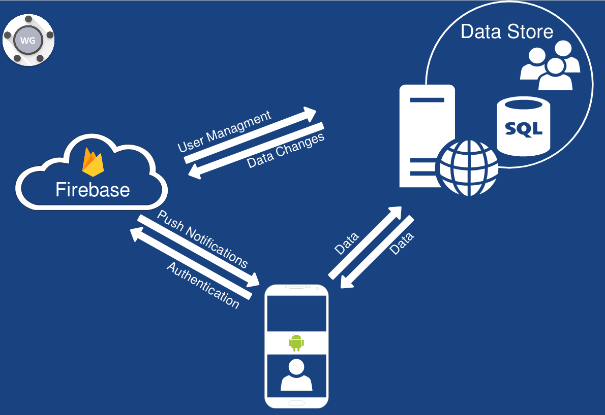

# Software Architecture Document

# Table of Contents
- [Introduction](#1-introduction)
    - [Purpose](#11-purpose)
    - [Scope](#12-scope)
    - [Definitions, Acronyms and Abbreviations](#13-definitions-acronyms-and-abbreviations)
    - [References](#14-references)
    - [Overview](#15-overview)
- [Architectural Representation](#2-architectural-representation)
- [Architectural Goals and Constraints](#3-architectural-goals-and-constraints)
- [Use-Case View](#4-use-case-view)
    - [Use-Case Realizations](#41-use-case-realizations)
- [Logical View](#5-logical-view)
    - [Overview](#51-overview)
    - [Architecturally Significant Design Packages](#52-architecturally-significant-design-packages)
- [Process View](#6-process-view)
- [Deployment View](#7-deployment-view)
- [Implementation View](#8-implementation-view)
    - [Overview](#81-overview)
    - [Layers](#82-layers)
- [Data View](#9-data-view)
- [Size and Performance](#10-size-and-performance)
- [Quality](#11-quality)

## 1. Introduction

### 1.1 Purpose
This document provides an overview of the system architecture. It contains a quick overview of the realization of the MVC-pattern as well as class diagrams which are relevant for the implementaion.

### 1.2 Scope
This document describes the architecture of the WGPlaner project.

### 1.3 Definitions, Acronyms and Abbreviations

| Abbrevation | Description                            |
| ----------- | -------------------------------------- |
| SRS         | Software Requirements Specification    |
| UC          | Use Case                               |
| MVC         | Model View Controller                  |
| n/a         | not applicable                         |

### 1.4 References

| Title                                         | Date       | Publishing organization   |
| --------------------------------------------- |:----------:| ------------------------- |
| [SRS](../SRS/SRS.md)                          | 2017-11-26 | WGPlaner Team             |

### 1.5 Overview
This document contains the Architectural Representation, Goals and Constraints as well 
as the Logical, Deployment, Implementation and Data Views.

## 2. Architectural Representation
For our project we have a server and client application. Both are connected to firebase for authorization and push notifications.
Following diagram shows the connection.

## 3. Architectural Goals and Constraints
tbd

## 4. Use-Case View

### 4.1 Use-Case Realizations
n/a

## 5. Logical View
tbd

### 5.1 Overview
tbd

### 5.2 Architecturally Significant Design Packages
tbd

## 6. Process View
n/a

## 7. Deployment View
tbd

## 8. Implementation View

### 8.1 Overview
n/a

### 8.2 Layers
n/a

## 9. Data View
tbd

## 10. Size and Performance
n/a

## 11. Quality
n/a
