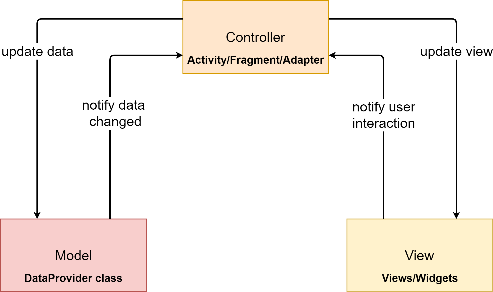
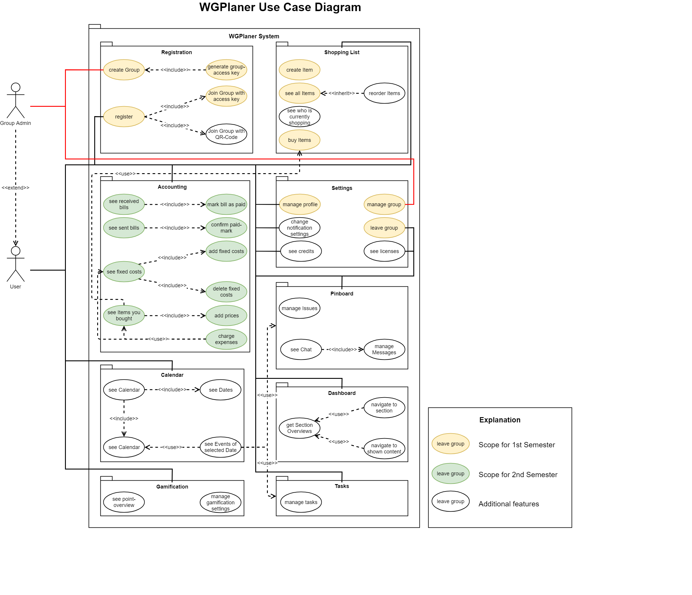
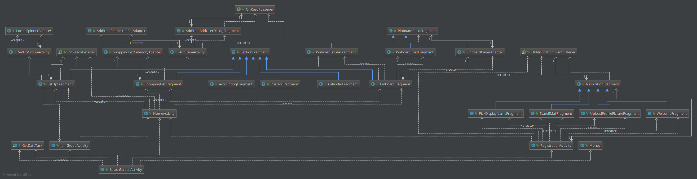
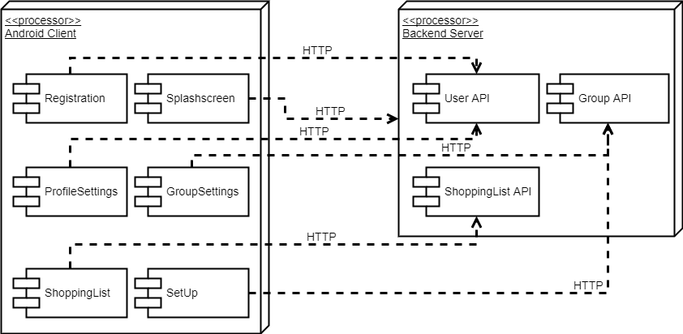
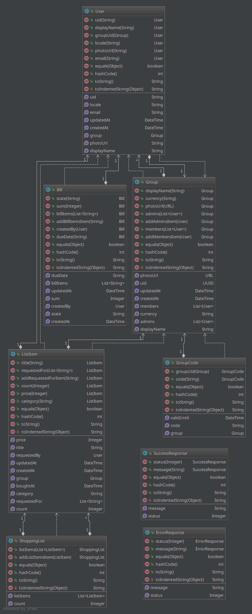

# Software Architecture Document

# Table of Contents
- [Introduction](#1-introduction)
    - [Purpose](#11-purpose)
    - [Scope](#12-scope)
    - [Definitions, Acronyms and Abbreviations](#13-definitions-acronyms-and-abbreviations)
    - [References](#14-references)
    - [Overview](#15-overview)
- [Architectural Representation](#2-architectural-representation)
- [Architectural Goals and Constraints](#3-architectural-goals-and-constraints)
- [Use-Case View](#4-use-case-view)
    - [Use-Case Realizations](#41-use-case-realizations)
- [Logical View](#5-logical-view)
    - [Overview](#51-overview)
    - [Architecturally Significant Design Packages](#52-architecturally-significant-design-packages)
- [Process View](#6-process-view)
- [Deployment View](#7-deployment-view)
- [Implementation View](#8-implementation-view)
    - [Overview](#81-overview)
    - [Layers](#82-layers)
- [Data View](#9-data-view)
- [Size and Performance](#10-size-and-performance)
- [Quality](#11-quality)

## 1. Introduction

### 1.1 Purpose
This document provides a comprehensive architectural overview of the system, using a number of different architectural views to depict different aspects of the system. It is intended to capture and convey the significant architectural decisions which have been made on the system.

### 1.2 Scope
This document describes the architecture of the WGPlaner project.

### 1.3 Definitions, Acronyms and Abbreviations

| Abbrevation | Description                            |
| ----------- | -------------------------------------- |
| SRS         | Software Requirements Specification    |
| UC          | Use Case                               |
| MVC         | Model View Controller                  |
| n/a         | not applicable                         |

### 1.4 References

| Title                                                | Date       | Publishing organization   |
| ---------------------------------------------------- |:----------:| ------------------------- |
| [WGPlaner Blog](http://wgplanerblog.wordpress.com/)  | 2017-11-26 | WGPlaner Team             |
| [SRS](../SRS/SRS.md)                                 | 2017-11-26 | WGPlaner Team             |
| [UC Pinboard](../UC/UC_Pinboard.md)                  | 2017-11-26 | WGPlaner Team             |
| [UC Registration](../UC/UC_Registration.md)          | 2017-11-26 | WGPlaner Team             |
| [UC Shopping List](../UC/UC_Shopping_List.md)        | 2017-11-26 | WGPlaner Team             |
| [UC Add Item](../UC/UC_Add_Item.md)                  | 2017-12-06 | WGPlaner Team             |
| [UC Buy Item](../UC/UC_Buy_Item.md)                  | 2017-12-06 | WGPlaner Team             |

### 1.5 Overview
This document contains the Architectural Representation, Goals and Constraints as well 
as the Logical, Deployment, Implementation and Data Views.

## 2. Architectural Representation
Android MVP-Pattern:

## 3. Architectural Goals and Constraints
The main goal of the MVP architecture is to separate the view from the logic. Therefore, the view does not implement the logic, but gets all the precompiled information from the controller.
Models contain the data that is displayed in the views.

## 4. Use-Case View
 

### 4.1 Use-Case Realizations
n/a

## 5. Logical View

### 5.1 Overview

### 5.2 Architecturally Significant Design Packages

This image represents the logical view at our MVP Implementation:

Android Client:

## 6. Process View
n/a

## 7. Deployment View

## 8. Implementation View

### 8.1 Overview
n/a

### 8.2 Layers
n/a

## 9. Data View
Database ER-Diagram:

## 10. Size and Performance
n/a

## 11. Quality
n/a
