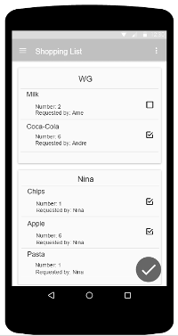
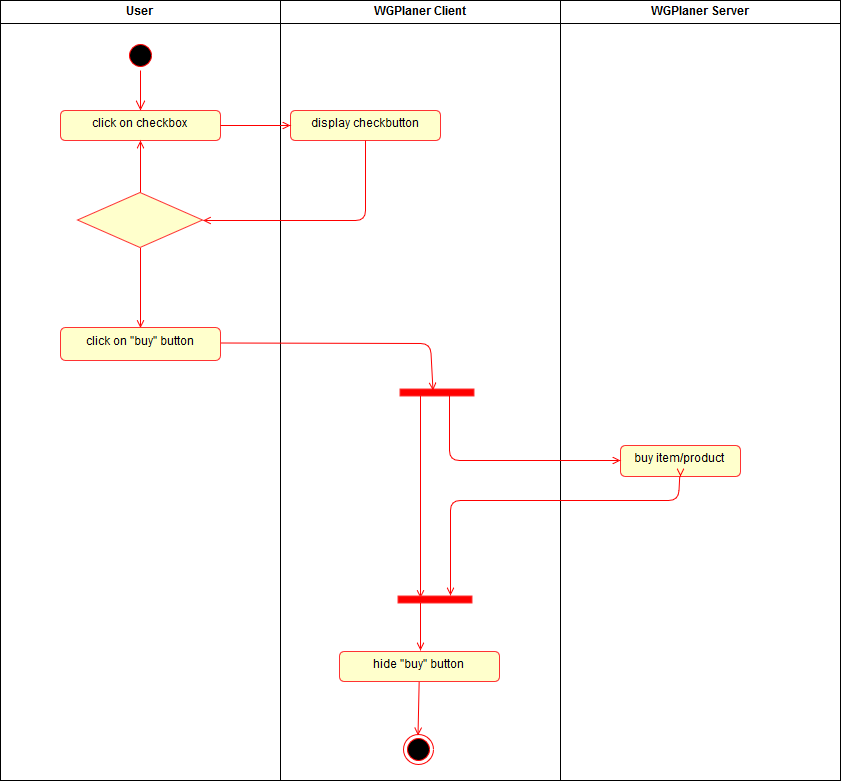

# Use-Case Specification: Buy Item

# 1. Change Settings

## 1.1 Brief Description
This use case allows users to buy products/items.
A product has a title and may contain information like the number of items and who the product shall be bought for. 
Bought items shall be removed from the list.

## 1.2 Mockup
### Checked List to buy produkts/items

## 1.3 Screenshot
### Shopping List with checked products
[Shopping List with checked products](../Screenshots/uc_add_item_blank.png)

### Shopping List after the products were bought
[Shopping List after the products were bought](../Screenshots/uc_buy_item_bougt_products.png)

# 2. Flow of Events

## 2.1 Basic Flow
Here is the activity diagram for buying one or more products/items.

## 2.2 Alternative Flows
n/a

# 3. Special Requirements
n/a

# 4. Preconditions
The main preconditions for this use case are:

 1. The users app instance is registered.
 2. The user is member of a group/shared flat.
 2. The user has started the app and has navigated to "Shopping List".

# 5. Postconditions

### 5.1 Save changes / Sync with server
If a product has been bought it must be synced with the server.

# 6. Extension Points
n/a
