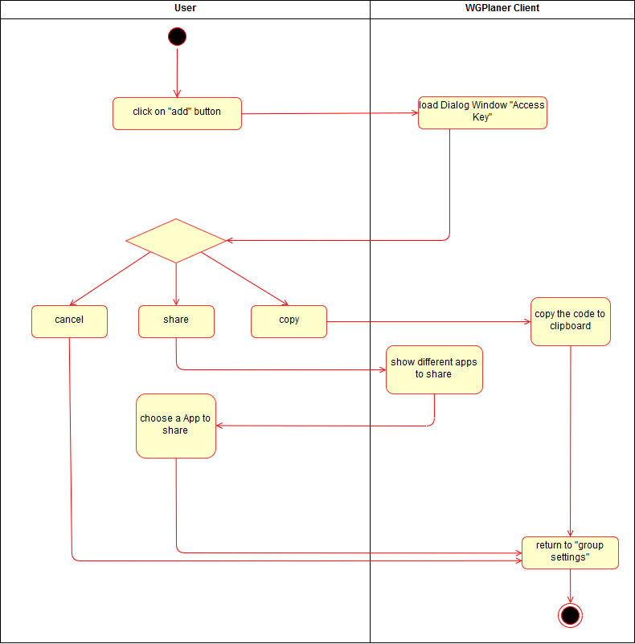

# Use-Case Specification: Invite new group member

# 1. Change Settings

## 1.1 Brief Description
This use case allows admins to invite a new group member to the shared flat. 
A group has a minimum one admin who can call up the access key to join a group.

## 1.2 Mockup
### Dialog Window with the Access Key

# 2. Flow of Events

## 2.1 Basic Flow
Here is the activity diagram for inviting a new group member.

## 2.2 Alternative Flows
n/a

# 3. Special Requirements
n/a

# 4. Preconditions
The main preconditions for this use case are:

 1. The users app instance is registered.
 2. The user is member of a group/shared flat.
 3. The user has to be a admin.
 4. The admin has started the app and has navigated to "Group Settings".

# 5. Postconditions
The server has to generate the Access Key to invite a new group member.

# 6. Extension Points
n/a
