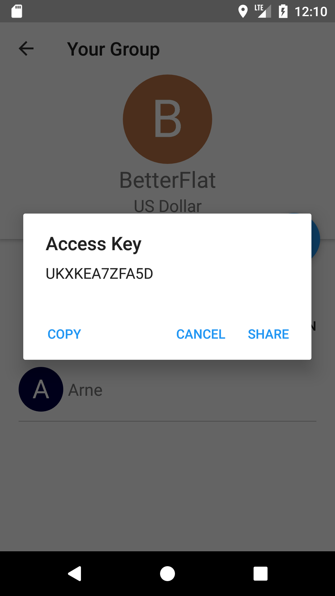

# Use-Case Specification: Invite new group member

# 1. Invite new group member

## 1.1 Brief Description
This use case allows admins to invite new group members to the shared flat.
A group has at minimum one admin who can call up the access key to join a group.

## 1.2 Mockup
### Group Settings Page, if admin

### Dialog Window with the Access Key

## 1.3 Screenshot
### Group Settings Page, if admin

### Dialog Window which opens at the button pressure

# 2. Flow of Events

## 2.1 Basic Flow
Here is the activity diagram for inviting new group members.

## 2.2 Alternative Flows
n/a

# 3. Special Requirements
n/a

# 4. Preconditions
The main preconditions for this use case are:

 1. The users app instance is registered.
 2. The user is member of a group/shared flat.
 3. The user has to be an admin.
 4. The admin has started the app and has navigated to "Group Settings".

# 5. Postconditions
The server has generated and stored the Access Key to invite new group members.

# 6. Function Points
To calculate function points, we used the tool on [http://groups.umd.umich.edu](http://groups.umd.umich.edu/cis/course.des/cis375/projects/fp99/main.html).

For this use case we got a score of *18* function points. It took 520min to implement this use case.

