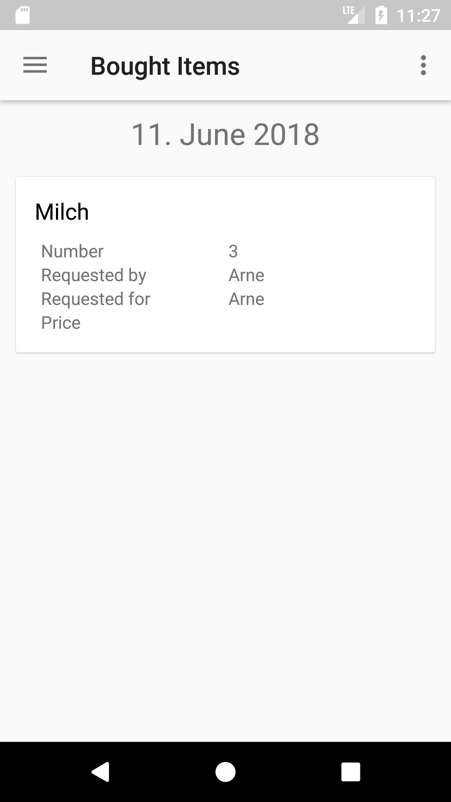
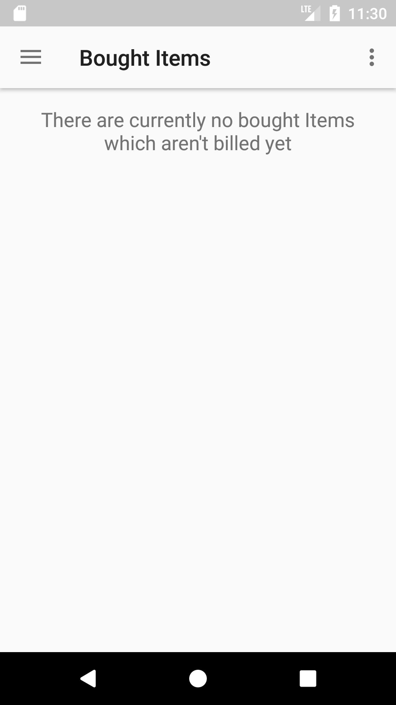
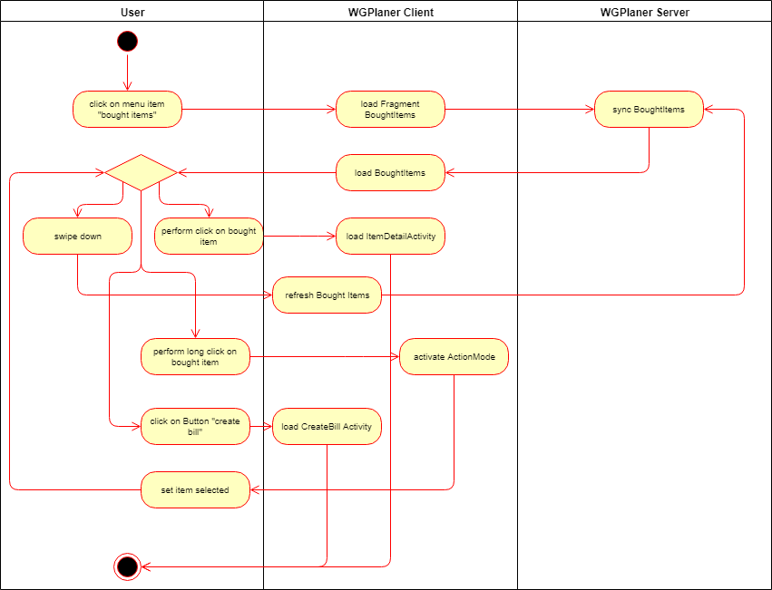
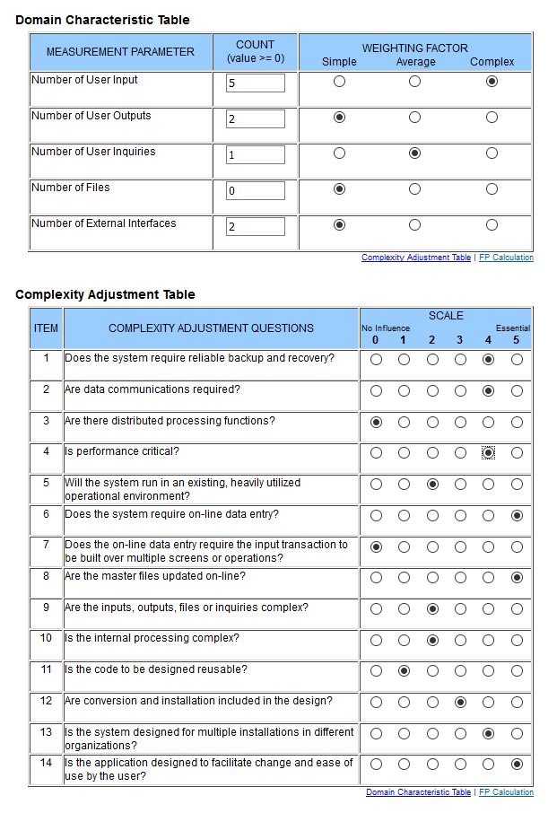

# Use-Case Specification: List bought items

# 1. List bought items

## 1.1 Brief Description
This use case allows users to list their bought items/products. A product has a title and may contain information like the number of items and who the product shall be bought for.

## 1.2 Mockup
### Page listing bought items

## 1.3 Screenshot
### List bought items - No items

### List bought items - With items

# 2. Flow of Events

## 2.1 Basic Flow

## 2.2 Alternative Flows
n/a

# 3. Special Requirements
n/a

# 4. Preconditions
The main preconditions for this use case are:

 1. The users app instance is registered.
 2. The user is member of a group/shared flat.
 3. The user has started the app and has navigated to "Bought Items".

# 5. Postconditions
As a result of this use case the user can see the list of bought items.

# 6. Function Points
To calculate function points, we used the tool on [http://groups.umd.umich.edu](http://groups.umd.umich.edu/cis/course.des/cis375/projects/fp99/main.html).

For this use case we got a score of *55* function points. It was estimated to take us 1080min to implement this use case.

