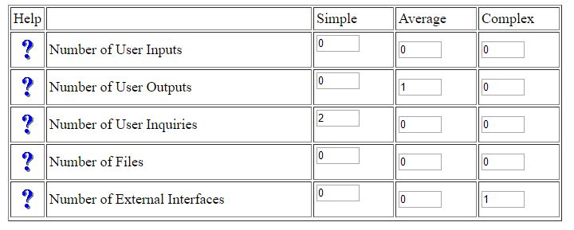
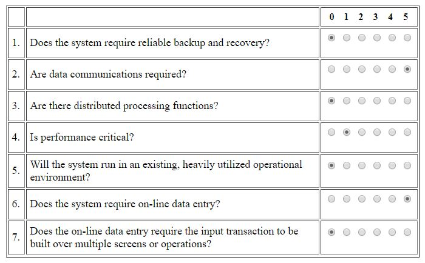
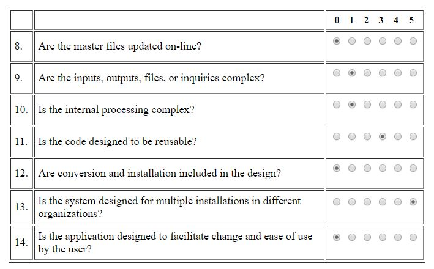

# Use-Case Specification: List fixed costs

*Note: Due to a team member leaving the group, this use case has gone out of scope. Read more on our [blog](https://wgplanerblog.wordpress.com/2018/04/09/roadmap-2nd-semester/)*

# 1. List fixed costs

## 1.1 Brief Description
This use case allows users to list fixed costs. Fixed costs are recurring costs (e.g. weekly/monthly) and contain a title, description and costs.

## 1.2 Mockup
### Page listing fixed costs

## 1.3 Screenshot
### Page "List fixed costs" - No items
*tbd*

### Page "List fixed costs" - With items
*tbd*

# 2. Flow of Events

## 2.1 Basic Flow
*tbd*

## 2.2 Alternative Flows
n/a

# 3. Special Requirements
n/a

# 4. Preconditions
The main preconditions for this use case are:

 1. The users app instance is registered.
 2. The user is member of a group/shared flat.
 3. The user has started the app and has navigated to "List Fixed Costs".

# 5. Postconditions
As a result of this use case the user can see all fixed costs.

# 6. Function Points
To calculate function points, we used the tool on [http://groups.umd.umich.edu](http://groups.umd.umich.edu/cis/course.des/cis375/projects/fp99/main.html).

For this use case we got a score of *18.06* function points. It is estimated to take us 590min to implement this use case.

