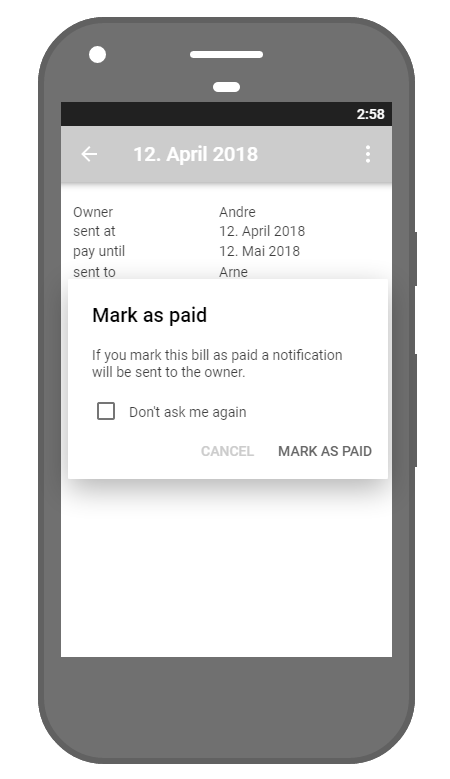

# Use-Case Specification: Pay bills

# 1. Pay bills

## 1.1 Brief Description
This use case allows users to mark their bills as "paid". A bill contains bought items and costs.

## 1.2 Mockup
### "Pay Bill" dialog

## 1.3 Screenshot
### Page "Pay Bill"
*tbd*

# 2. Flow of Events

## 2.1 Basic Flow
*tbd*

## 2.2 Alternative Flows
n/a

# 3. Special Requirements
n/a

# 4. Preconditions
The main preconditions for this use case are:

 1. The users app instance is registered.
 2. The user is member of a group/shared flat.
 3. The user has started the app and has navigated to "Pay Open Bills".

# 5. Postconditions
As a result of this use case the user has marked a bill as paid or canceled the action.

# 6. Function Points
n/a
