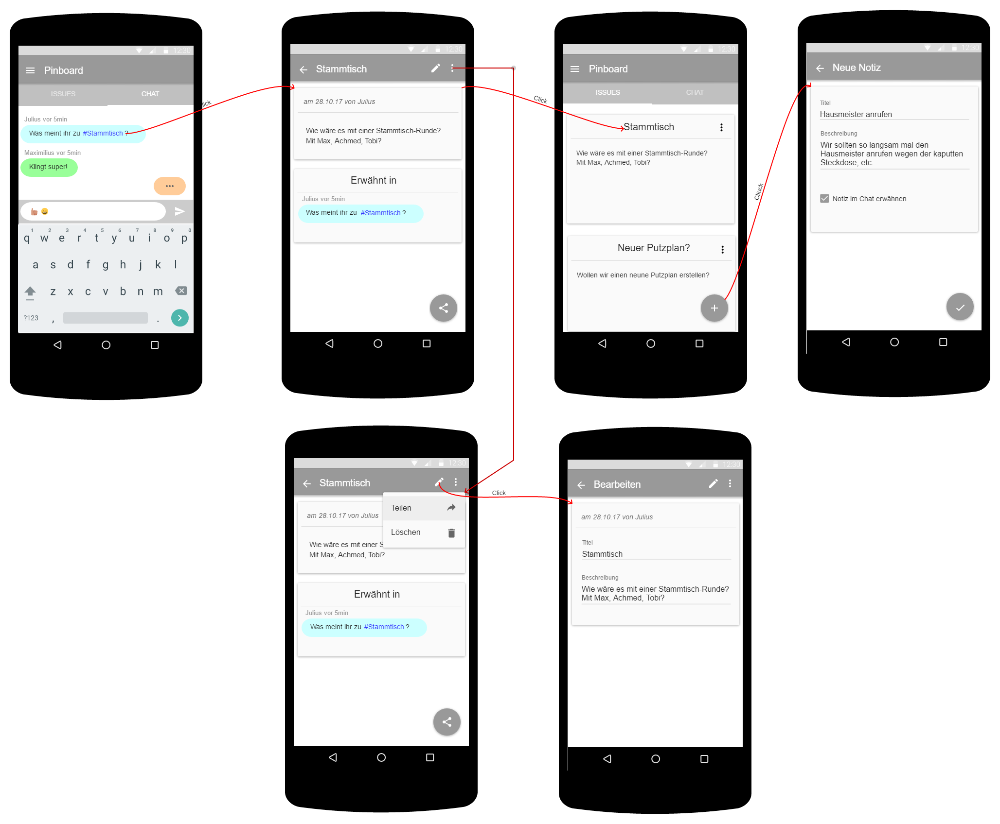

# Use-Case Specification: Pinboard

# 1. Pinboard

## 1.1 Brief Description
This use case allows users to add notes to a pinboard and to manage them in their shared flat. A note may consist of a title and a description. The user may reference the note in the chat-part of the pinboard by writing `#TitleOfNote`.

## 1.2 Mockup

## 1.3 Feature Files
*tbd*

# 2. Flow of Events

## 2.1 Basic Flow
*tbd*

## 2.2 Alternative Flows
*tbd*

# 3. Special Requirements
n/a

# 4. Preconditions
The main preconditions for this use case are:

 1. The users app instance is registered.
 2. The user is member of a group/shared flat.
 2. The user has started the app and has navigated to "Pinboard".

# 5. Postconditions

### 5.1 Save changes / Sync with server
If a note has been added, edited or removed, it must be synced with the server.

### 5.2 Chat is synced / Users get notified
The chat has to be synced immediately so that other users may be notified. A push notification that a new message is available should be send to the other shared flat members.

# 6. Extension Points
n/a
