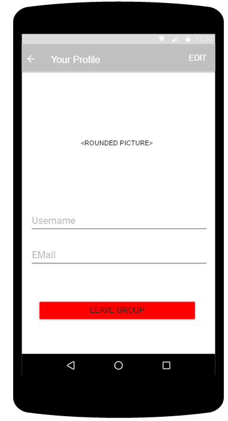
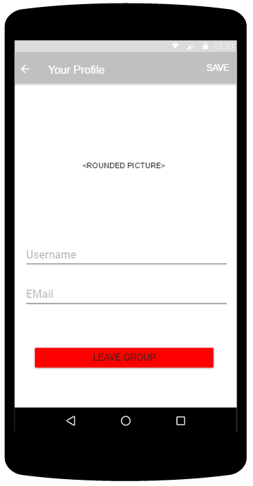
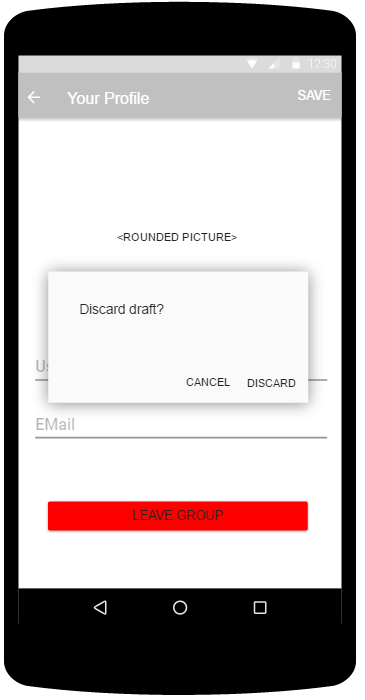
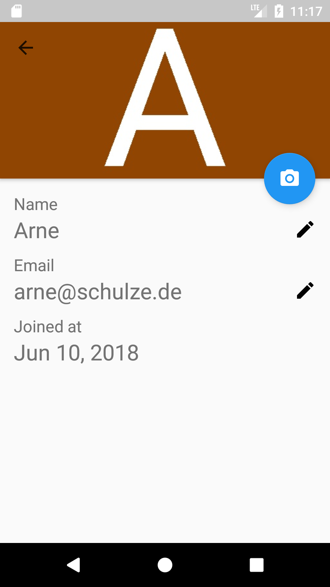
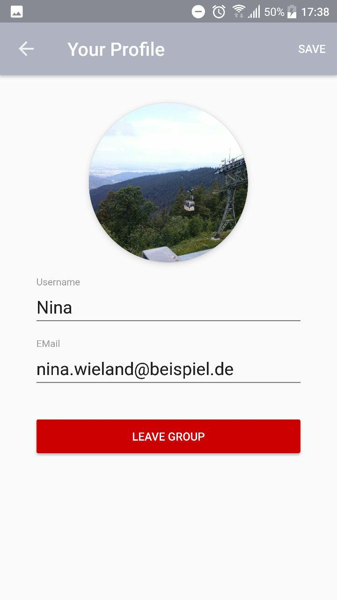
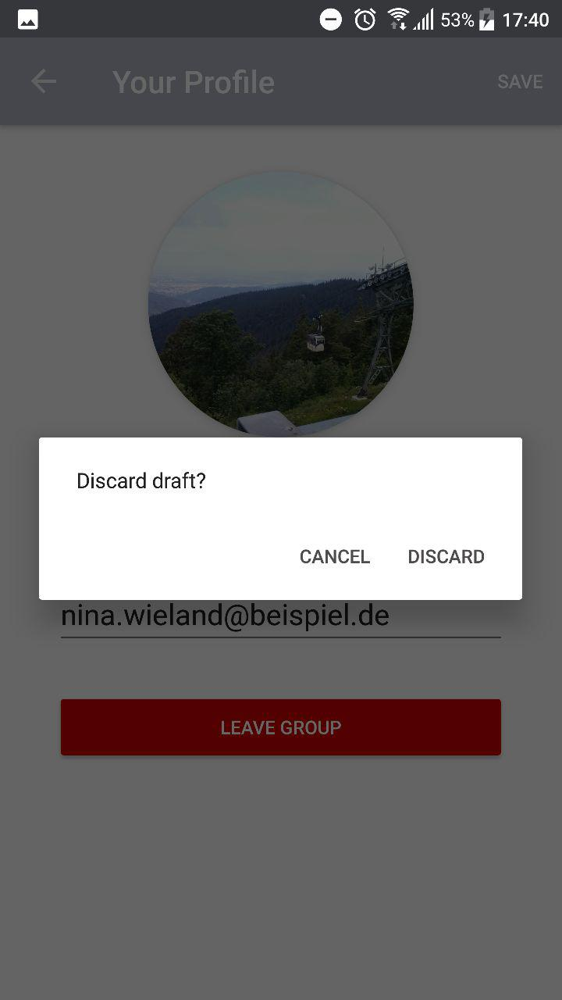
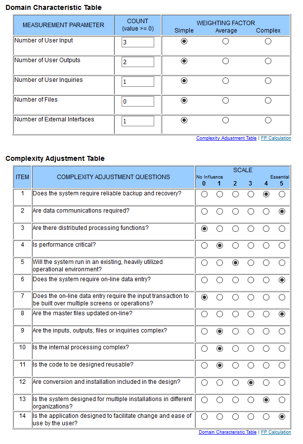

# Use-Case Specification: Profile Settings

# 1. Profile Settings

## 1.1 Brief Description
This use case allows users to edit their personal profile settings.
A user has a name, a profile picture and an email. Profile picture and email are optional.

## 1.2 Mockup
### Profile Settings Page, not editable

<!--
### Profile Settings Page, if editing is activated

### Profile Settings Page, if editing is canceled

-->

## 1.3 Screenshot
### Profile Settings Page, not editable

<!--
### Profile Settings Page, if editing is activated

### Profile Settings Page, if editing is canceled

-->

# 2. Flow of Events

## 2.1 Basic Flow
Here is the activity diagram for editing the personal profile.

## 2.2 Alternative Flows
n/a

# 3. Special Requirements
n/a

# 4. Preconditions
The main preconditions for this use case are:

 1. The users app instance is registered.
 2. The user is member of a group/shared flat.
 3. The user has started the app and has navigated to "Profile Settings".

# 5. Postconditions
## 5.1 Save changes / Sync with server
The users profile has been saved and stored on the server.

# 6. Function Points
To calculate function points, we used the tool on [http://groups.umd.umich.edu](http://groups.umd.umich.edu/cis/course.des/cis375/projects/fp99/main.html).

For this use case we got a score of *26* function points. It took 730min to implement this use case.

