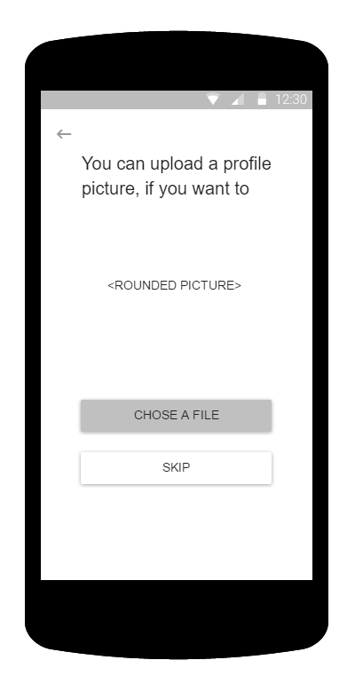
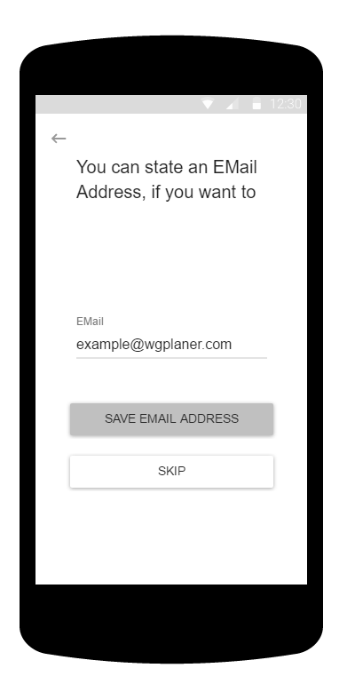

# Use-Case Specification: Registration

# 1. Change Settings

## 1.1 Brief Description
This use case allows users to register for the WGPlaner Android Application. To do so, they have to pick a Username, which does not have to be unique. Additionally they can upload a profile picture or state an email address.

## 1.2 Mockup
### "Welcome" Screen
 
### "Pick Display Name" Screen

### "Upload Profile Picture" Screen

### "State Email Address" Screen

## 1.2 Screenshot
### "Welcome" Screen
 
### "Pick Display Name" Screen

### "Upload Profile Picture" Screen

# 2. Flow of Events

## 2.1 Basic Flow

## 2.2 Alternative Flows

No specified alternative flows.

# 3. Special Requirements
n/a

# 4. Preconditions

The main preconditions for this use case are:
1. The users app instance is not registered
2. The user has started the app

# 5. Postconditions

The main postconditions for this use case are:
1. The user is registered/has created an account
2. The user has picked a name

# 6. Extension Points

1. Future implementation may contain more possibilities to declare personal data
2. Future implementation may contain a registration via a google account
