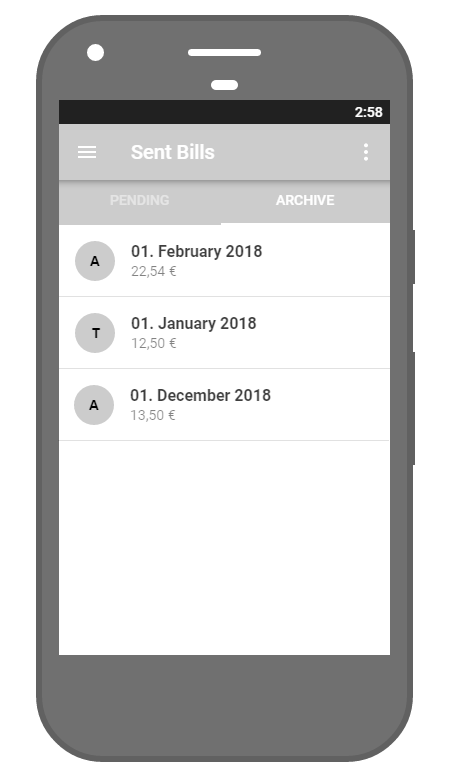
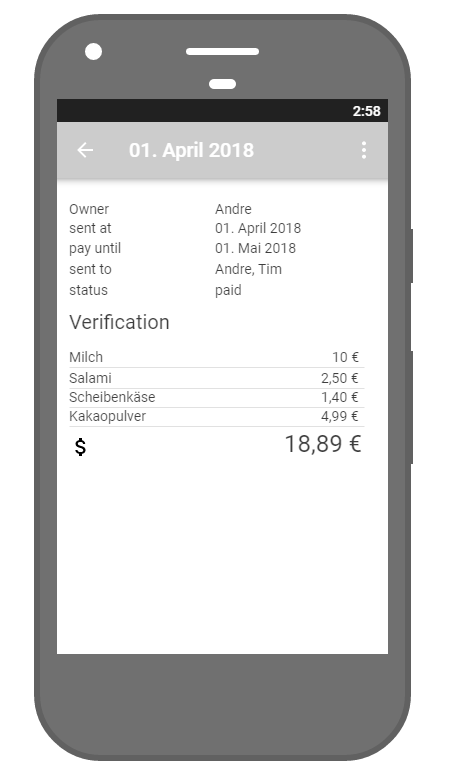
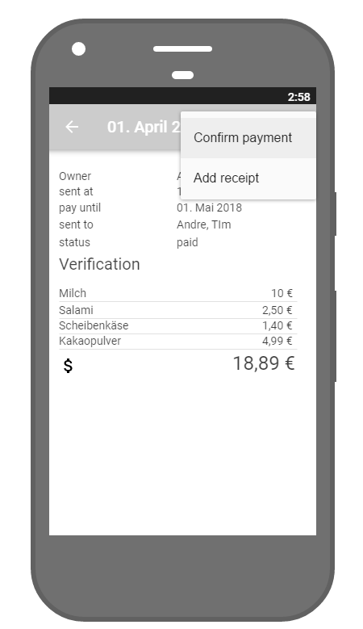
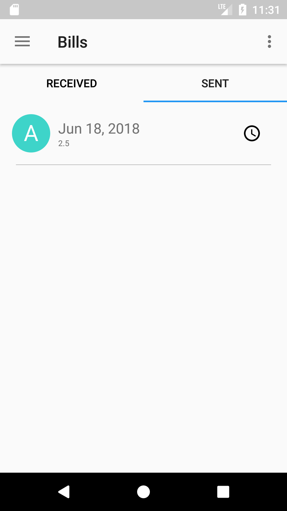
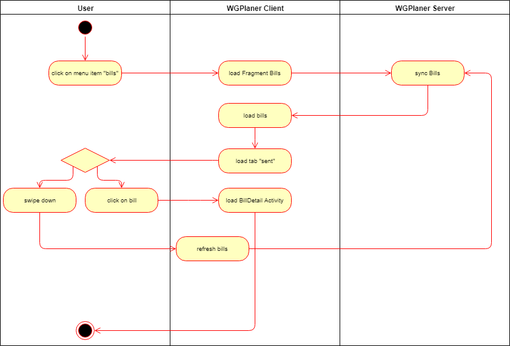

# Use-Case Specification: See sent bills

# 1. See sent bills

## 1.1 Brief Description
This use case allows users to list their sent bills. A bill contains bought items.

## 1.2 Mockup
### Page listing pending

### Page showing archived sent bills

### Page showing sent bill

### Page showing sent bill - action menu

## 1.3 Screenshot
### List sent bills - No bill

### List sent bills - With bills

# 2. Flow of Events

## 2.1 Basic Flow

## 2.2 Alternative Flows
n/a

# 3. Special Requirements
n/a

# 4. Preconditions
The main preconditions for this use case are:

 1. The users app instance is registered.
 2. The user is member of a group/shared flat.
 3. The user has started the app and has navigated to "Sent Bills".

# 5. Postconditions
As a result of this use case the user can see the list of received bills.

# 6. Function Points
n/a
