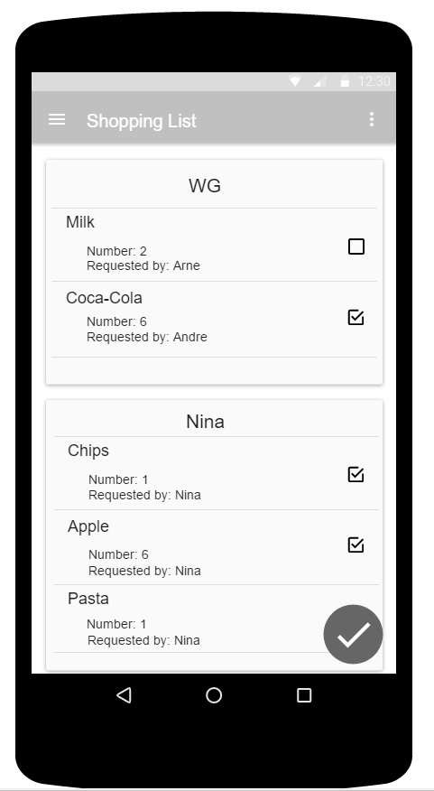
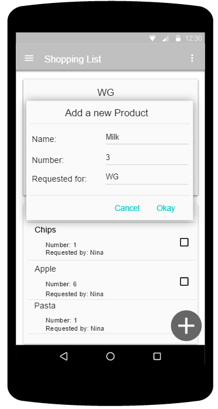
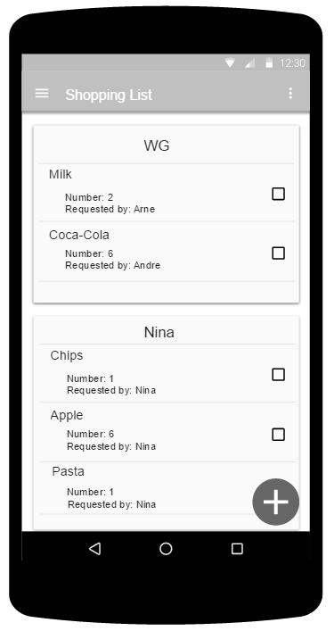
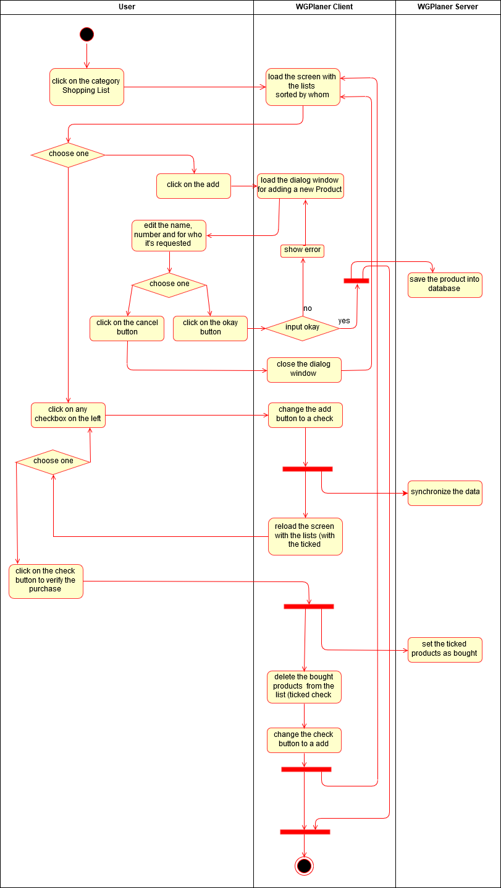

# Use-Case Specification: Shopping List

# 1. Change Settings

## 1.1 Brief Description
*TODO*

## 1.2 Mockup

# 2. Flow of Events

## 2.1 Basic Flow

## 2.2 Alternative Flows

### 2.2.1 *TODO*
*TODO*

# 3. Special Requirements

## 3.1 *TODO*

# 4. Preconditions

## 4.1 *TODO*
*TODO*

# 5. Postconditions

### 5.1 *TODO*
*TODO*

# 6. Extension Points

## 6.1 *TODO*
*TODO*
