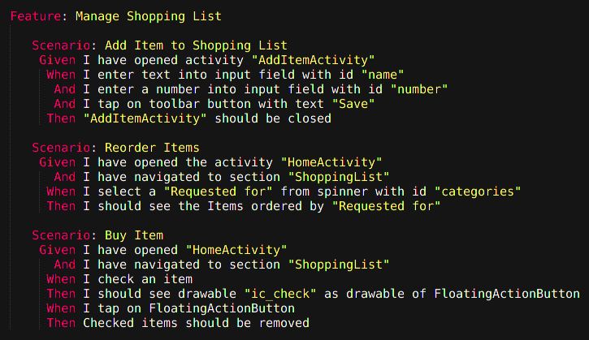

# Use-Case Specification: Shopping List

# 1. Change Settings

## 1.1 Brief Description
This use case allows users to add products/items to a shopping list and manage them. A product has a title and may contain information the number of items and who the product shall be bought for. Bought items shall be removed from the list.

## 1.2 Mockup

# 2. Flow of Events

## 2.1 Basic Flow
Here is the activity diagram for managing the shopping list.

And here is a screenshot of the `.feature` file for this use case:

## 2.2 Alternative Flows
n/a

# 3. Special Requirements
n/a

# 4. Preconditions
The main preconditions for this use case are:

 1. The users app instance is registered.
 2. The user is member of a group/shared flat.
 2. The user has started the app and has navigated to "Shopping List".

# 5. Postconditions

### 5.1 Save changes / Sync with server
If a product has been added, edited or removed, it must be synced with the server.

# 6. Extension Points
n/a
